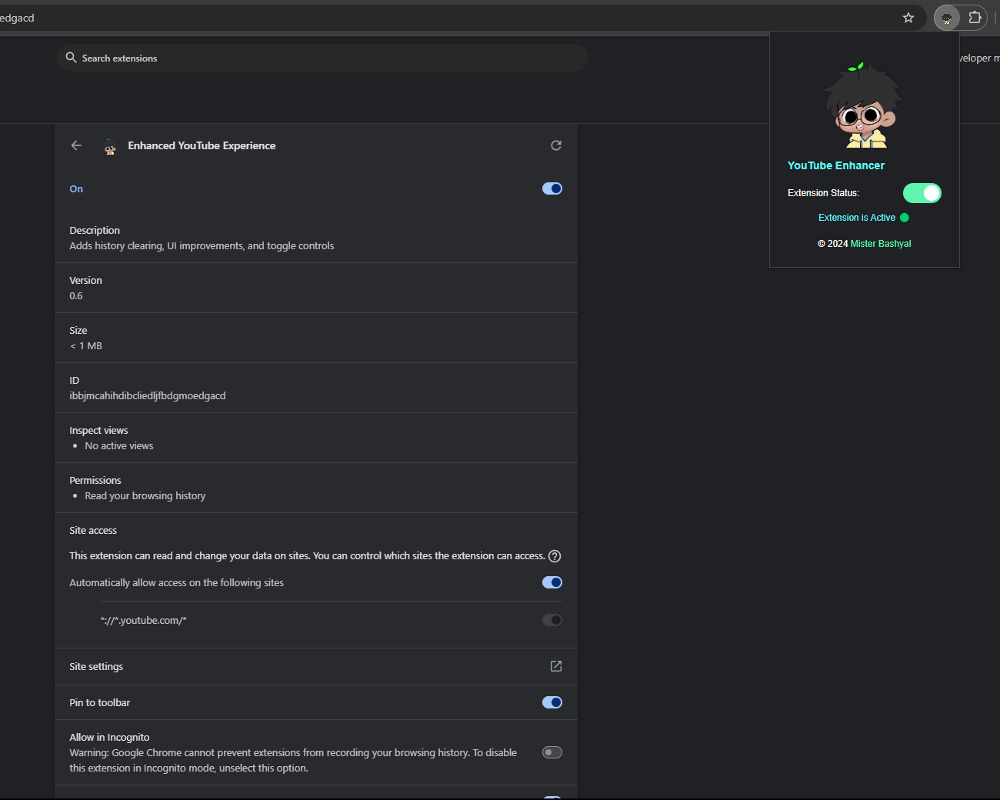
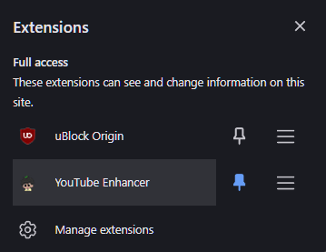

# YouTube Enhancer



YouTube Enhancer is a powerful browser extension that enhances your YouTube experience by adding various features and customization options. Whether you want to improve your video watching experience or streamline your interactions on the platform, this extension has you covered.

## Key Features

- **Enhanced Video Player**: Enjoy a more immersive video playback experience with improved controls and styling.
- **Subscription and Comments Enhancements**: Customize how you interact with comments and subscriptions for a better engagement experience.
- **Shorts to Long Video Redirect**: Automatically redirect YouTube Shorts to their corresponding long-form videos for easier viewing.
- **Clear History Button**: Quickly clear your YouTube watch history with a single click.
- **Customizable Settings**: Toggle features on and off based on your preferences directly from the extension popup.

```js
youtube-enhancer/
│
├── Functions/
│   ├── vidplayer.css
│   ├── shorts2long.css
│   ├── subs-comment.js
│   ├── vidplayer.js
│   ├── subsbutton.js
│   ├── subs-comment.css
│   ├── shortsblock.css
│   ├── element-hiding.css
│   ├── shortsblock.js
│
├── manifest.json       # Extension configuration
├── popup.html          # Extension popup interface
├── popup.js            # Popup functionality and logic
├── popup_styles.css    # Popup styling
├── feature-handlers.js  # Background service worker
├── content.js          # Content script for YouTube pages
└── icons/
├── icon48.png      # Small extension icon
├── icon128.png     # Medium extension icon
├── icon16.png      # Tiny extension icon
├── icon32.png      # Additional icon size
└── trash.png       # Additional image asset
```

## Installation Guide
1. **Clone the Repository**:
    ```bash
    git clone https://github.com/Prarambha369/youtube-enhancer.git
    ```
2. **Open the Extensions Page**:
   - For **Chrome**: Navigate to `chrome://extensions/`
   - For **Firefox**: Go to `about:addons`
3. **Enable Developer Mode** (Chrome) or Debug Mode (Firefox).
4. **Load the Extension**:
   - Click on "Load unpacked" (Chrome) or "Load Temporary Add-on" (Firefox) and select the folder where you cloned the repository.

## How to Use

1. Click on the YouTube Enhancer icon in your browser toolbar to open the popup interface.
- 
2. Use the toggle switches to enable or disable specific features according to your needs.
- 
3. Enjoy a personalized YouTube experience tailored to your preferences!

## Contributing

We welcome contributions from the community! If you have suggestions, improvements, or bug fixes, please feel free to open an issue or submit a pull request.

## License

This project is licensed under the MIT License. For more details, please refer to the [LICENSE](LICENSE) file.

## Acknowledgments

- Special thanks to the YouTube platform for providing a space for content creators and viewers.
- Thanks to the open-source community for their continuous support and contributions.

## Contact Information

For any questions or feedback, please reach out to [Mister Bashyal](https://github.com/Prarambha369). Your input is valuable to us!
